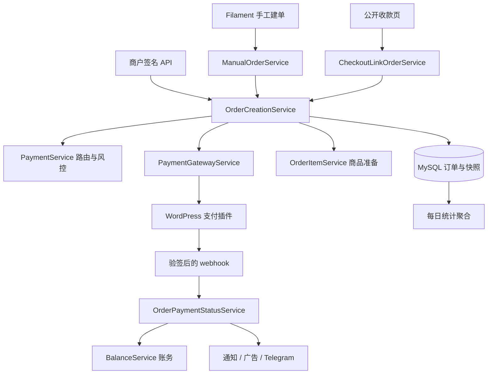

# 系统架构

核对日期：2026-09-28。本文按当前仓库实现整理；基线与旧资料差异见 [开发记录](development-log.md)。入口约定见 [AGENTS.md](../AGENTS.md)，数据语义见 [database.md](database.md)。

## 1. 系统职责与技术栈

系统连接商户应用、WordPress/WooCommerce 支付站点和管理后台，负责下单路由、支付状态、商户账务、物流、通知、统计与公开收款链接。

| 层面 | 当前实现 |
|---|---|
| 服务端 | PHP `^8.2`、Laravel `^12.0`、bcmath；具体安装版本以 `composer.lock` 为准 |
| 管理端 | Filament `^5.0`，Spatie Permission `^6.25` |
| 数据 | MySQL 为生产目标；Eloquent、软删除、生成列唯一约束 |
| 缓存/队列 | Laravel Cache/Queue 抽象，生产部署文档使用 Redis；驱动由环境配置决定 |
| 前端 | Blade、Vite `^7.0.7`、Tailwind CSS `^4.0.0`，依赖见 `package.json`/锁文件 |
| 文件与外部集成 | 阿里云 OSS、WordPress 支付插件、WooCommerce 商品、邮件、Telegram、广告转化、Cloudflare SaaS/Turnstile |

这是主要职责图，非完整状态机；远端 HTTP 建单在本地订单事务提交后执行。

## 2. 请求入口与访问边界

路由装配在 [bootstrap/app.php](../bootstrap/app.php)。

| 入口 | 路由/代码 | 访问方式 |
|---|---|---|
| 平台后台 `/admin` | `app/Providers/Filament/AdminPanelProvider.php` | 超管、商户级管理员；可限制平台域名 |
| 商户后台 `/merchant` | `app/Providers/Filament/MerchantPanelProvider.php` | 归属商户的用户；与平台端共享 Resource 配置 |
| 观察者 `/observer` | `app/Providers/Filament/ObserverPanelProvider.php` | 独立 `Observer` 模型及 `observer` guard，按渠道授权只读 |
| `/api/order/create`、`query`、`ship` | [routes/api.php](../routes/api.php) | POST，`api.auth` 验签，身份从 Application 取得 |
| `/api/webhooks/payment-gateway/status` | `PaymentGatewayWebhookController` | POST，独立 `X-PGA-Signature` 验签 |
| `/payment/{token}` | [routes/web.php](../routes/web.php)、`PaymentPageController` | 已存在订单的付款链接 |
| `/c/{slug}` | [routes/checkout.php](../routes/checkout.php)、`CheckoutLinkController` | 可反复建单的公开收款链接，使用 web/session/CSRF 中间件 |
| 争议附件 | `DisputeAttachmentController` | 控制器内检查访问权限，不因公开路由而公开文件 |

租户过滤有三种场景：

- 登录 `User`：`MerchantScope` 调 `User::manageableMerchantIds()`；超管返回 `null` 表示不限，商户级管理员返回名下商户 ID，普通用户返回自身商户 ID。
- API、CLI、队列：没有后台用户，业务调用必须显式限定商户，或说明为何执行全平台任务。
- 观察者：`MerchantScope` 不处理 `Observer`，Resource 根据 `observer_payment_methods` 过滤订单。不能依赖默认 guard 的用户一定是 `User`。

`PaymentMethod` 自己覆盖商户 scope：既支持商户自有渠道，也支持经 `merchant_payment_methods` 分配的系统级渠道。`owner_id` 解决管理员维护未分配渠道时的可见性；编辑权限还需查 Resource。

订单列表的物流模板导出沿用当前筛选与搜索条件，不要求平台账号选定单个商户；超管可跨商户导出，其他用户限定在 `manageableMerchantIds()` 范围。物流上传仍绑定登录用户所属商户。订单支付方式筛选及观察者账户的渠道分配包含软删除渠道，保留渠道的租户可见性过滤；观察者关联也包含软删除渠道，以便回显和保留已有分配。

## 3. 下单链路

主要入口：[OrderCreationService.php](../app/Services/OrderCreationService.php)。

1. 对 `merchant_id + merchant_order_no` 加缓存锁（当前租期 30 秒、等待 10 秒）。查到旧单时比较币种与原始请求金额（`original_amount`，历史单回退 `amount`）；冲突拒绝，匹配则复用快照/渠道。旧单没有 `pay_url` 时尝试远端补单。
2. 校验 `amount = subtotal + shipping_fee - discount + tax`，公式容差由 `Order::AMOUNT_TOLERANCE` 定义（当前 0.01）；商品明细按两位小数核对小计。
3. 应用开启自动折扣时，首次建单随机减免原币种应付金额，保存原始金额及折扣快照；然后读取汇率及汇损，换算 USD。回跳域名校验的当前策略见 [D-05](decisions.md#d-05-下单域名策略)。
4. 校验支付组归属且启用。普通路径经 `PaymentService` 筛选风控后，选当天成交额/权重最小的渠道；指定 `payment_method_key` 的路径跳过组内路由与限额检查，但仍检查渠道可用范围、启用状态和三个回跳 URL 的渠道域名。
5. 计算并固定交易手续费及 `settlement_amount`；手续费超过 USD 金额拒单。在数据库事务内写订单、原始商品明细。
6. 指定渠道新单在本地落库后触发 `DesignatedOrderCreated`。随后准备匹配商品并调用插件 `/pay`，回填 `pay_url`、`wp_order_id`；远端失败保留本地订单，供幂等重试恢复。
7. 是否派发付款链接邮件由调用方决定，Service 仅保存意图。API 重试补单后的发信行为由 `OrderCreateRetryMailTest` 覆盖。

两类明细不可混用：`order_items` 保存商户原始商品，`order_matched_items` 保存发给支付站点的商品。`OrderItemService` 支持 `MATCH`、`VIRTUAL`、`CREATE`、`COPY`；同站点直连优先于模式选择。`CREATE`/`COPY` 需要远端真实商品 ID，因此下单过程同步建品。

锁只覆盖同一商户订单号，不等于对整个支付渠道做额度预占；风控当前统计已成交数据，不能宣称它严格串行化所有渠道订单。

## 4. 支付状态与账务

[OrderPaymentStatusService](../app/Services/OrderPaymentStatusService.php) 共用 webhook 的 `handle()` 与主动查询的 `queryAndApply()`，最终统一进入状态应用逻辑。它处理状态映射、行锁、重复/乱序守卫、首次 `paid_at`/`failed_at`、账务和通知编排。

| 行为 | 当前实现 |
|---|---|
| 支付成功 | 首次正常进入 `paid` 后，经 `BalanceService::creditForPaidOrder()` 按 `settlement_amount` 入账，派发商户通知与广告转化 |
| 重复/乱序状态 | 相同状态跳过；已收款订单不被未收款状态回退；终态有保护 |
| 网关 `refunded` / `confused` | 后者映射 `chargeback`；尝试自动退款/拒付记账。业务性失败保留状态并告警，支持人工补录 |
| 网关 `disputing` | 网关争议中，更新状态并拉日志；不等同人工冻结审核 |
| 人工 `dispute_review` | `OrderDisputeService` 编排，资金由 `BalanceService` 冻结/释放；期间网关状态不会覆盖人工审核状态 |
| 物流 | `OrderShippingObserver` 在符合条件时推进 `shipped`，并派发物流同步 |
| 订单事件日志 | `OrderEventSyncService` 拉取插件 `/order-logs` 归档；不以日志反推支付状态 |

余额写操作集中在 [BalanceService](../app/Services/BalanceService.php)。锁顺序先商户行、再相关订单/业务单据。当前状态事务与退款/拒付账务事务分开，避免反向加锁造成死锁；不可描述为远端状态和本地资金全程原子提交。人工资金动作使用 `FinanceSecurity` 做 TOTP 二次验证。

## 5. 队列和调度

| 队列 | 执行者 | 重试来源 |
|---|---|---|
| `notifications` | `SendOrderNotificationJob` | Job `tries=1`，重试由尝试记录与到期扫描驱动 |
| `payment-links` | `SendPaymentLinkJob` | Job `tries=3`、backoff |
| `default` | `SendTelegramNotification` 队列监听器 | Worker 配置 |
| `low` | 商品同步、物流导入、物流回传、广告转化 | 按 Job 定义；广告转化也由尝试表驱动重试 |

`config/queue.php` 的 Redis `retry_after` 必须大于长任务 Worker timeout。现有 `composer dev` 的默认 `queue:listen` 不能代替订阅全部业务队列的 Worker；启动方式参考部署文档。队列配置的 `after_commit` 当前为 false，新增事务内派发时要明确提交时机。

以下按 [routes/console.php](../routes/console.php) 核对，共 12 个调度条目：

| 命令 | 频率 |
|---|---|
| `exchange:fetch` | 每小时 |
| `db:backup:upload` | 每 6 小时 |
| `order-events:sync` | 每分钟，防重叠 |
| `order-notifications:process-due` | 每分钟，防重叠 |
| `ad-conversions:process-due` | 每分钟，防重叠 |
| `order-disputes:close-due`、`order-disputes:send-reminders` | 各每 5 分钟，防重叠 |
| `fund-freezes:release-due` | 每 5 分钟，防重叠 |
| `order-stats:aggregate --days=8` | 每天 02:00，防重叠 |
| `order-stats:aggregate --days=2` | 每 3 小时，防重叠 |
| `checkout:check-cloudflare-ips` | 每周一 09:00 |
| `checkout:sync-domains` | 每 15 分钟，防重叠 |

## 6. 按任务定位

以下完整路径以仓库根目录为基准；同一表格单元内的后续文件省略相同目录前缀。

| 任务 | 首先阅读 | 现有测试入口 |
|---|---|---|
| 下单、幂等、邮件补发 | `app/Http/Controllers/Api/OrderController.php`、`app/Services/OrderCreationService.php`、`app/Services/ManualOrderService.php` | `tests/Feature/OrderCreateRetryMailTest.php`、`DesignatedOrderTelegramNotificationTest.php` |
| 路由与限额 | `app/Services/PaymentService.php`、`app/Models/PaymentMethod.php`、`app/Models/PaymentGroup.php` | `tests/Feature/PaymentRiskPaidAtTest.php` |
| 退款、拒付、账务 | `app/Services/OrderPaymentStatusService.php`、`app/Services/BalanceService.php` | `tests/Feature/GatewayRefundChargebackTest.php`、`tests/Feature/Filament/MerchantWithdrawalRequestTest.php` |
| 统计 | `app/Services/OrderStatsAggregator.php`、`OrderStatsQueryService.php`、`DashboardService.php` | `tests/Feature/OrderStatsAggregatorTest.php`、`DashboardOrderStatsAlignmentTest.php`、`tests/Feature/Filament/OrderStatsPageTest.php` |
| 收款链接和域名 | `app/Services/Checkout/`、`app/Http/Controllers/CheckoutLinkController.php`、`app/Models/CheckoutLink.php` | `tests/Feature/CheckoutLinkTest.php`、`tests/Feature/Filament/CheckoutLinkFormTest.php`、`MerchantDomainResourceTest.php` |
| 物流与争议附件 | `app/Services/OrderShippingService.php`、`OrderDisputeService.php`、`app/Observers/OrderShippingObserver.php` | `tests/Feature/OrderShippingRecordTest.php`、`LogisticsTemplateTest.php`、`DisputeAttachmentTest.php` |
| 权限、面板和用户 | `app/Models/User.php`、`app/Models/Observer.php`、`app/Models/Scopes/MerchantScope.php`、`app/Support/Permissions.php`、相关 Resource | 按功能选择 `tests/Feature/Filament/`，补充真实越权边界的断言 |

这些是现有测试入口，不代表对应模块已完整覆盖或本次已运行测试。
