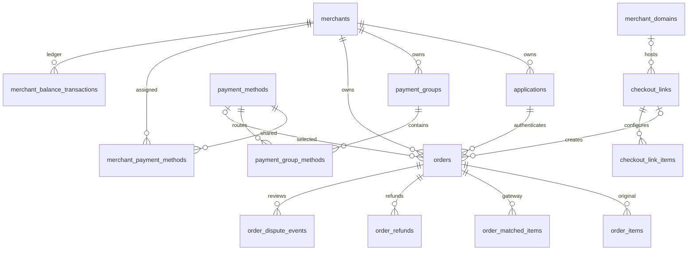

# 数据库与重要模型

核对日期：2026-09-28。结构依据是 [database/migrations/](../database/migrations/) 的完整迁移链，运行语义依据是 [app/Models/](../app/Models/) 和 [app/Services/](../app/Services/)。本文不替代字段级迁移定义，也不代表已核验生产库。

## 1. 核心关系

图为核心关系摘要；具体外键、可空与删除策略以迁移为准。`payment_methods.merchant_id` 还支持商户直接拥有渠道（系统级渠道该字段为 NULL）。

## 2. 租户、身份和渠道

| 表 / 模型 | 关键语义 |
|---|---|
| `merchants` / `Merchant` | 商户主体；`owner_id` 为所属平台管理员，`balance`/`frozen_balance` 为 USD 总余额/冻结额 |
| `users` / `User` | `is_super_admin`、`merchant_id` 区分超管、商户级管理员和商户用户；范围入口为 `manageableMerchantIds()` |
| `roles`、权限相关表 | Spatie 权限；商户角色有商户归属，平台共享角色另有范围。定义见 `app/Support/Permissions.php` 与 `PermissionSeeder` |
| `applications` / `Application` | 商户接入身份、`app_id`、加密 `api_key`、应用网站与邮件/广告配置 |
| `payment_methods` / `PaymentMethod` | 渠道、站点、网关配置、限额、费率、商品模式。`merchant_id=NULL` 表示系统级渠道；`owner_id` 标识维护者 |
| `merchant_payment_methods` | 系统级渠道分配给商户的多对多表；不是所有订单的商户归属表 |
| `payment_groups` / `PaymentGroup` | 商户的路由组，`group_key` 在该商户未删除记录内唯一 |
| `payment_group_methods` | 组内渠道，`group_id`/`method_id`，`priority` 为分流权重 |
| `payment_method_config_maps`、`payment_method_profiles` | 网关字段模板及渠道资料附表；profile 每渠道至多一条 |
| `observers`、`observer_payment_methods` | 独立观察者账户与允许查看的渠道；展示缩放不修改账务金额 |

`PaymentMethod::forMerchant()` 的含义是“商户可使用”，包含自有与已分配渠道；不能用普通商户外键过滤替代。`site_products.merchant_id` 也可为空，商品实际按支付渠道关联，避免假设所有业务模型均有非空商户 ID。

## 3. 订单及金额快照

`orders` / [Order](../app/Models/Order.php) 是中心模型：

| 字段组 | 语义与限制 |
|---|---|
| `order_no` | 本地系统订单号，同时作为插件 `s_order_id`；通过生成器与唯一约束处理碰撞 |
| `merchant_id` + `merchant_order_no` | 未软删订单的幂等键。重复请求比较 `currency` 和数值 `amount`，并非校验所有明细字段一致 |
| `application_id`、`payment_group_id` | 建单应用与支付组 |
| `payment_method_id`、`payment_method` | 渠道 ID 与代码快照。当前渠道代码在未删除渠道中全局唯一；历史解析复用 `paymentMethodConfig()` |
| `designated_payment_method_key` | 记录本次是否显式指定渠道，区别于普通组内路由 |
| `source`、`platform`、`checkout_link_id` | 入口来源（`api`/`manual`/`checkout_link`）、平台类型、可选的收款链接关联 |
| `currency`、`subtotal`、`shipping_fee`、`discount`、`tax`、`amount` | 订单原币种金额；公式容差当前为 0.01，商品小计按两位小数核对 |
| `converted_currency`、`converted_amount`、各 `*_converted` | 下单时折算金额，结算基准 USD；成交额统计使用 `converted_amount` |
| `original_exchange_rate`、`exchange_rate`、`surcharge_*` | 市场汇率、实际汇率与汇损快照；不能用当前汇率回算历史单 |
| `fee_percent_amount`、`fee_fixed_amount`、`settlement_amount` | 下单时交易手续费与净入账快照；支付入账使用 `settlement_amount` |
| `refunded_amount` | 累计退款原币种金额，不是 USD |
| `pay_url`、`wp_order_id`、`transaction_id` | 远端收银台链接、WordPress 订单 ID、网关交易号。缺少 `pay_url` 的本地单可能需要补建远端 |
| `payment_link_token`、`send_mail`、`payment_link_sent_at` | 订单级付款链接与邮件意图/发送时间，不等同于 `checkout_links.slug` |
| `paid_at`、`failed_at` | 首次支付/失败时间；插件支付时间按 UTC 解析后转系统时区，首次写入后不覆盖 |

金额计算应保持十进制字符串/bcmath；数据库金额多为 `decimal`，模型用相应 decimal cast。远端 JSON 或现存风控部分代码有 float 转换，不应据此将账务计算改为浮点运算。

商品数据分为四层：

- `order_items`：商户传入的原始明细及折算单价。
- `order_matched_items`：支付站点实际接收的明细、来源变体及自动创建信息。
- `site_products` / `site_product_variations`：按渠道同步的站点商品/变体快照，用于匹配与复制。
- `replace_keywords`：`COPY` 模式所用的商户商品名称替换规则。

## 4. 状态、资金与审计

`Order::NEVER_PAID_STATUSES = ['pending', 'failed', 'cancelled', 'expired']`。`paidEver()` 取其补集，包含发货、完成、部分退款、退款、拒付、网关争议和人工争议审核状态。新增状态会影响风控和统计，必须同步审查这个口径。

| 表 / 模型 | 关键语义 |
|---|---|
| `merchant_balance_transactions` | 总余额变动台账，含前后余额、金额、类型、关联单据与 `idempotency_key`；自动支付入账键为 `order_paid:{order_id}` |
| `merchant_withdrawals` | `pending` 冻结金额；批准扣总余额并释放占用，驳回仅释放冻结额 |
| `merchant_fund_freezes` | 人工资金冻结及可选到期释放；与提现/争议冻结分别记录来源，共同影响 `frozen_balance` |
| `order_refunds` | 退款单：原币种 `amount`、USD `amount_usd` 等；同一订单允许多次部分退款 |
| `order_dispute_events` | 人工审核事件，`processing`/`closed`、冻结金额快照、到期与关闭原因。`final_action` 是拟定方向，不自行退款/拒付 |
| `order_dispute_event_replies` | 回复、操作人及凭证附件；不延长原审核期限 |
| `order_shippings` | 每订单最多一条未删除物流记录，另有向插件同步的状态/错误信息 |
| `order_events` | 插件事件归档，按系统订单号与外部日志 ID 去重，不驱动订单状态 |
| `order_notification_attempts` | 商户回调每次尝试的请求、响应、结果、下次重试时间 |
| `ad_conversion_attempts` | 按订单/广告平台/尝试编号记录转化发送与重试 |
| `logistics_import_tasks`、`logistics_import_task_records` | 批量物流导入任务及逐行结果 |

余额可为负；可用余额 = `balance - frozen_balance`，提现不得超过可用额。冻结/释放通常改变冻结额并维护对应业务单据，不代表每次冻结都发生总余额增减。金融审计表不能套用普通配置表的删除策略。

## 5. 收款链接与域名

| 表 | 语义 |
|---|---|
| `merchant_domains` | 商户域名、Cloudflare 自定义 hostname/证书状态，未删除 `host` 全局唯一 |
| `checkout_links` | 商户可重复使用的收款配置；关联应用、支付组及可选商户域名，支持固定/范围金额、支持国家、说明等 |
| `checkout_link_items` | 链接预设商品；实际下单时转换为 `order_items` |
| `orders.checkout_link_id` | 订单来源追踪；一个链接可以产生多笔订单 |

链接的 `slug` 在未删除记录中唯一；每次公开下单生成新的商户订单号，不能把 slug 或客户邮箱作为跨提交固定幂等键。自有域名是否可用由 `MerchantDomain::isReady()` 和 `CheckoutLink::allowedHosts()` 配合判断。

## 6. 汇率与统计派生数据

- `exchange_rates`：当前汇率，`base_currency + target_currency` 唯一；下单汇率数据源。
- `exchange_rate_histories`：追加式历史展示数据，不参与下单金额计算。
- `order_daily_stats`：按 `stat_date + merchant_id + application_id + payment_method_id` 唯一；渠道 ID `0` 表示未知维度，刻意不设渠道外键，避免删除渠道改写汇总维度。
- `order_stats_runs`：每个统计日的执行完成记录；`rows_written=0` 表示已算但无交易，与未运行区分。

| 指标 | 归日时间 | 金额口径 |
|---|---|---|
| 支付成功 | `orders.paid_at`，旧数据为空时回退 `created_at` | `converted_amount`，含曾支付成功的后续状态 |
| 支付失败 | `orders.failed_at`，旧数据为空时回退 `created_at` | `converted_amount`，只数 `failed` |
| 退款 | `order_refunds.created_at` | 实退 `amount_usd`，当日订单数去重 |
| 拒付 | 拒付本金流水 `created_at` | 本金流水金额绝对值，不含拒付手续费 |

按系统时区分日；商户展示时区不改变分桶。汇总可重算，每日事务内删除旧桶再插入新桶，随后记录执行结果；超出滚动窗口的历史修正需按受影响日期补算。

## 7. 唯一约束与迁移

软删除表使用生成列：有效记录映射原值，删除记录映射 NULL，再建唯一索引。不要简化为 `(业务键, deleted_at)`；MySQL 对 NULL 的唯一性处理不能达到同样效果。

| 约束 | 当前含义 |
|---|---|
| `orders.order_no_uniq`、`payment_link_token_uniq` | 未删除订单的系统号/付款 token 唯一 |
| `orders(merchant_id, merchant_order_no_uniq)` | 商户内有效订单幂等 |
| `payment_methods.method_code_uniq` | 有效渠道代码全局唯一，已由 2026-09-21 迁移替换早期商户内唯一规则 |
| `applications.app_id_uniq` | 有效应用 ID 全局唯一 |
| `payment_groups(merchant_id, group_key_uniq)` | 商户内有效支付组键唯一 |
| `order_shippings.order_id_uniq` | 每订单仅一条有效物流记录 |
| `order_dispute_events.order_id_active_uniq` | 仅 `processing` 状态参与，同一订单最多一个处理中审核事件 |
| `merchant_balance_transactions.idempotency_key` | 自动资金动作幂等；允许人工动作无幂等键 |
| `merchant_payment_methods(merchant_id, payment_method_id)` | 渠道分配不重复 |

迁移存在 `IF`、`CONCAT`、带排序的 `GROUP_CONCAT` 等 MySQL 特征；`phpunit.xml` 目前仍使用 SQLite 内存库，测试兼容性需单独核验。不要仅根据初始建表迁移推断最终约束。

新增数据结构同时检查：模型 fillable/casts/关系、权限与租户范围、现有数据回填、索引、删除策略、相关 FormRequest/Resource 和测试。种子顺序见 `DatabaseSeeder`，商户角色创建前必须已存在权限记录。

`Application::api_key` 及部分邮件/广告凭证依赖 Laravel 加密 cast；沿用原 `APP_KEY` 才能读取已有数据。文档与测试样例只用占位凭证。
